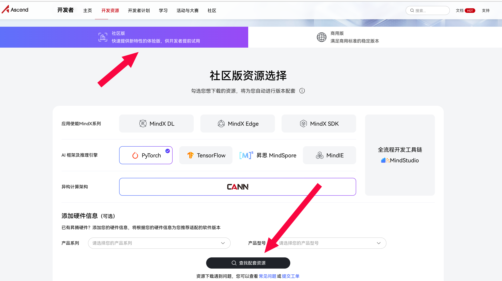
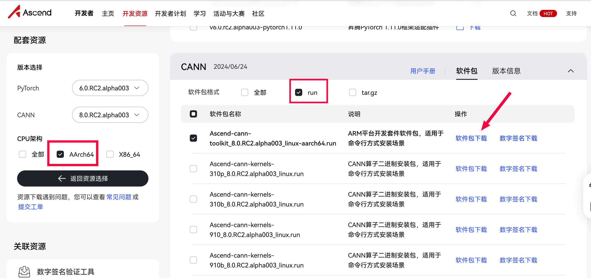

# orangepi_aipro_samples

## 介绍
本仓库用于存放Orangepi_Ai_Pro的相关案例代码。

## 环境准备
### 硬件
基于Orangepi_Ai_Pro (8-12T)或Orangepi_Ai_Pro (20T)

### 软件
当前代码基于CANN=8.0.RC2.alpha003桌面环境测试，下载方式如下：

访问[昇腾社区下载页面](https://www.hiascend.com/developer/download)，选择社区版，点击下方的查找配套资源。==请不要添加硬件信息，之间点击查找即可，不然会找不到8.0的CANN包==

选择CPU架构为AArch64，CANN软件包格式为run。软件包有点多，不要下错了，下载Ascend-cann-toolkit_xxx_linux-aarch64.run，其中xxx为版本号。

下载完成后上传到开发板，执行

`chmod +x ./Ascend-cann-toolkit_xxx_linux-aarch64.run  #xxx替换为实际版本号`

`sudo ./Ascend-cann-toolkit_xxx_linux-aarch64.run --install  ##xxx替换为实际版本号`

如果之前开发板上安装有CANN软件包，请先执行`sudo ./Ascend-cann-toolkit_xxx_linux-aarch64.run --uninstall`，否则可能会安装失败。

#### 使用说明

1.  xxxx
2.  xxxx
3.  xxxx

#### 参与贡献

1.  Fork 本仓库
2.  新建 Feat_xxx 分支
3.  提交代码
4.  新建 Pull Request
